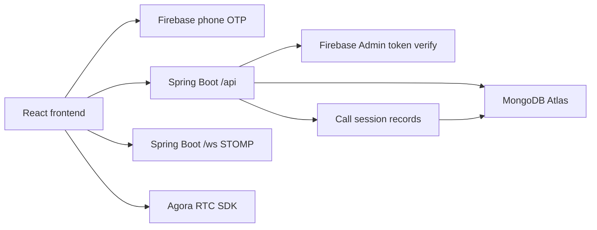

# LoveConnect Mongo Firebase Agora

Full-stack dating app starter with:

- Java Spring Boot backend
- MongoDB Atlas database integration
- Firebase Authentication phone OTP login
- Secure REST APIs with Firebase ID token validation
- WebSocket/STOMP real-time one-to-one chat
- Agora-ready one-to-one audio and video call sessions
- Responsive React frontend

## Architecture



## Free-tier setup

1. Create a MongoDB Atlas M0 cluster and copy the connection string into `MONGODB_URI`.
2. Create a Firebase project, enable Phone Authentication, add your local/deployed domains, and create a web app.
3. In Firebase project settings, generate a service account JSON for the backend and provide it as `FIREBASE_SERVICE_ACCOUNT_JSON`.
4. Create an Agora project. For quick development, you can disable token authentication and set only `AGORA_APP_ID`. For production, enable token security and add server-side token generation.

## Backend

```powershell
cd backend
copy .env.example .env
mvn spring-boot:run
```

Important environment variables:

- `MONGODB_URI`: MongoDB Atlas URI or local Mongo URI.
- `FIREBASE_SERVICE_ACCOUNT_JSON`: full Firebase service account JSON string.
- `APP_CORS_ALLOWED_ORIGINS`: comma-separated frontend URLs.
- `AGORA_APP_ID`: Agora app ID.
- `ALLOW_DEV_TOKENS`: set `true` only for local API testing.

API docs are available at `http://localhost:8080/swagger-ui.html`.

## Frontend

```powershell
cd frontend
copy .env.example .env
npm install
npm run dev
```

Open `http://localhost:5174`.

Frontend environment variables:

- `VITE_API_URL=http://localhost:8080/api`
- `VITE_FIREBASE_API_KEY`
- `VITE_FIREBASE_AUTH_DOMAIN`
- `VITE_FIREBASE_PROJECT_ID`
- `VITE_FIREBASE_APP_ID`
- `VITE_ENABLE_DEV_TOKEN=true` for local backend testing with `ALLOW_DEV_TOKENS=true`

## Local development with Docker

This compose file starts MongoDB and the backend with dev tokens enabled:

```powershell
docker compose up --build
```

Then run the frontend separately with `npm run dev`. Login with a dev token like:

```text
dev:+919999999999
```

## Production notes

- Keep `ALLOW_DEV_TOKENS=false`.
- Store secrets in your cloud provider secret manager.
- Add your production frontend URL to `APP_CORS_ALLOWED_ORIGINS`.
- Use HTTPS for all public deployments.
- Enable Firebase authorized domains for deployed frontend URLs.
- For Agora production security, generate RTC tokens on the backend instead of returning `null`.
- Add rate limiting and abuse monitoring before public launch.

## Main endpoints

- `GET /api/health`
- `GET /api/auth/me`
- `GET /api/profiles`
- `GET /api/profiles/me`
- `PUT /api/profiles/me`
- `GET /api/chats/{otherUid}`
- `POST /api/chats/messages`
- `POST /api/calls/start`
- `POST /api/calls/{callId}/end`
- `GET /api/calls/history`

## Tests to add next

- Backend integration tests with Testcontainers MongoDB.
- Firebase token filter tests with a mocked `FirebaseTokenService`.
- Chat service tests for deterministic conversation IDs.
- Frontend component tests for OTP login, chat send, and call controls.
